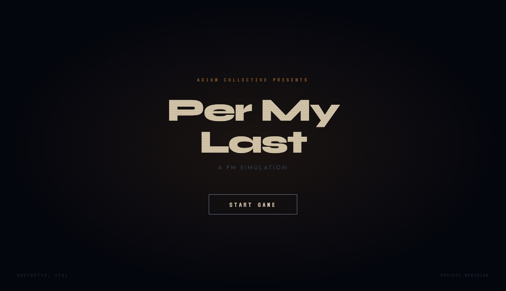

# Per My Last

**A PM simulation.** You are the new product manager at Axiom Collective. The roadmap is political, the stakeholders are watching, and every conversation nudges trust, wariness, and the story the company tells itself. Your long game: survive the quarter and deliver the Q3 review without the room turning on you.



## What you’ll do

- **Walk a living office** — Explore a top-down corporate floor in the browser: four departments, corridors, water-cooler gossip, and characters who move on their own rhythms.
- **Talk to the inner circle** — Petra (product), Callum (legal), Simone (engineering), and Marcus (comms) each have their own agendas. Dialogues branch; your tone and choices shift how they see you.
- **Handle scenarios** — When alignment breaks down, you face structured decisions with real consequences for the narrative and for stakeholder optics.
- **Track time** — Weeks and weekdays advance as you play; key beats (like reviews and alignment meetings) show up when the calendar says they should.
- **Use your desk** — Open your private terminal (**C**) to see stakeholder trust, respect, wariness, and loyalty without cluttering the map — your quiet PM notebook, not a public dashboard.

## Why it exists

*Per My Last* is a narrative game about **optics**: how decisions look, who gets credit, and what happens when engineering, legal, product, and comms hear the same sentence four different ways. It’s part satire, part pressure cooker, part love letter to anyone who has ever written “Per my last email” and meant something else entirely.

## Who it’s for

Anyone who has sat in standups, roadmap reviews, or “quick alignment” calls — and anyone who enjoys choice-driven stories with a sharp corporate flavour.

---

### Play it locally

The playable build lives in [`axiom-game/`](axiom-game/). From that folder:

```bash
npm install
npm run dev
```

Then open the URL Vite prints (usually `http://localhost:5173`).

---

*Axiom Collective presents — **Per My Last**: a PM simulation.*
